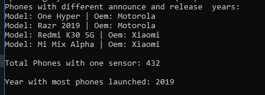

Report

Which programming language and version did you pick?
---
I am using C# version 11 and .NET version 7.0.5

Why did you pick this programming language?
---
I chose this language because I wanted to make some sort of game, and read/heard that it is a good language to use to do so.

How your programming language chosen handles: object-oriented programming, file ingestion, conditional statements, assignment statements, loops, subprograms (functions/methods),
unit testing and exception handling. If one or more of these are not supported by your programming language, indicate it as so. 
---
From what I read and used, C# supports all of these features. Like java in uses these the same way with slight differences in syntax. One example are variable needing a '?' after its type
in order for it to hold a null value. Additionally unit testing works a differently here from java (i think) but not too sure because I did not have the time to fully mess around with as there
are a lot of other assignments I wanted to finish on time.

List out 3 libraries you used from your programming language (if applicable) and explain what they are, why you chose them and what you used them for.
---
Microsoft.VisualBasic.FileIO, System.Text.RegularExpressions, and System.Text were the three libraries I used. The first library (FileIO) allowed the program to open an input stream
to read the csv file. The second(RegularExpressions) allow the program to use regex and filter out parts of the data in the file. The third (text) allowed the progrma to hold the data from 
the csv file in an object, and use its method to peform different actions on it, such as identifying each column.
 
Answer the following questions (and provide a corresponding screen showing output answering them):
---
What company (oem) has the highest average weight of the phone body?
Was there any phones that were announced in one year and released in another? What are they? Give me the oem and models.
How many phones have only one feature sensor?
What year had the most phones launched in the 2000s? 

